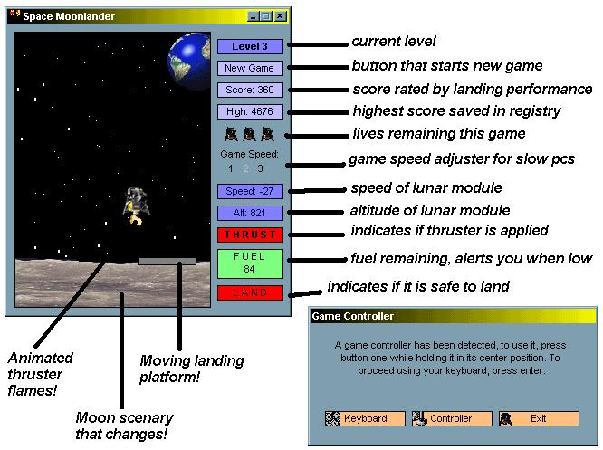



## Moonlander 2

### Description

Land a space craft onto a moving platform, has 10 levels. Supports game controllers, good graphics and good fun! Scores you on your landing performance and saves the highest score.
 
### More Info
 
Controls (Game controller)

BUTTON 1 = THRUST

BUTTON 2 = NEW GAME

Controls (Keyboard)

N = New Game

DOWN ARROW = Thrust

             |
---                |---
**Submitted On**   |2001-07-28 01:23:24
**By**             |[Chris Wilson UK](https://github.com/Planet-Source-Code/PSCIndex/blob/master/ByAuthor/chris-wilson-uk.md)
**Level**          |Intermediate
**User Rating**    |5.0 (30 globes from 6 users)
**Compatibility**  |VB 6\.0
**Category**       |[Games](https://github.com/Planet-Source-Code/PSCIndex/blob/master/ByCategory/games__1-38.md)
**World**          |[Visual Basic](https://github.com/Planet-Source-Code/PSCIndex/blob/master/ByWorld/visual-basic.md)
**Archive File**   |[Moonlander236347272001\.zip](https://github.com/Planet-Source-Code/chris-wilson-uk-moonlander-2__1-25579/archive/master.zip)

